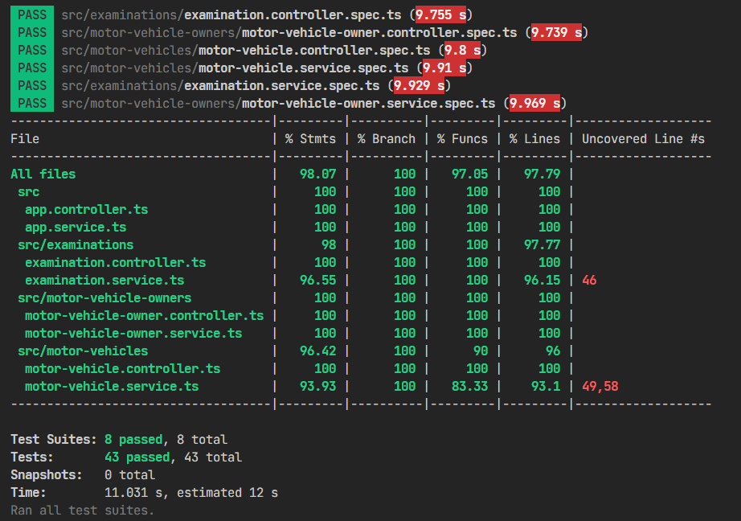
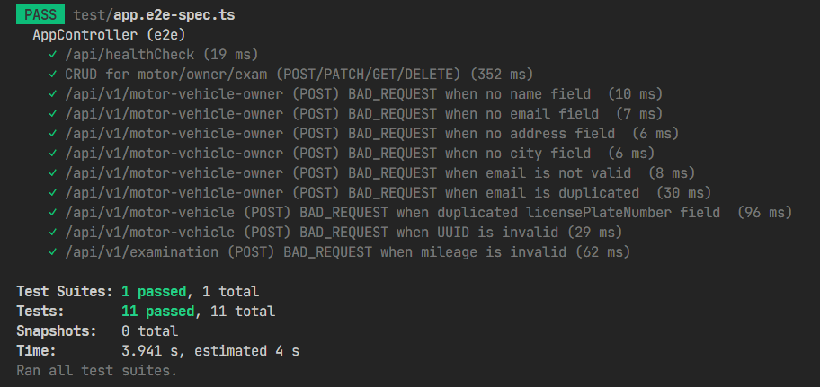
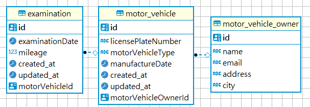

## Quick Run

```bash
cp env-example .env
docker-compose up
```

You can open below service to see!

- Swagger: http://localhost:3000/docs
- Adminer (client for DB): http://localhost:8080

## For local Development

1. update the env

```bash
cp env-example .env
Change DATABASE_HOST=postgres to DATABASE_HOST=localhost
```

2. run additional container:

```bash
docker-compose up -d postgres adminer
```

3.1 for the first time:

```
npm install

npm run migration:run

npm run seed:run
```

3.2 make sure everything is okay before development
(code style, format, unit test, ts compile issue)

```
npm run pre:dev
```

3.3 kick off the dev server

```
npm run start:dev
```

You can open below service to see!

- Swagger: http://localhost:3011/docs

## Unit Test

```bash
npm run test:coverage
```

## End-to-End Tests in Docker

```bash
npm run test:e2e:docker
```

## Current test coverage




## ER Diagram



## To-Fix

- [] handle co-current issue when update, think about which level I want to use
- [] fix create logic bug: will still return valid object if we go into catch block. Even you try to solve this by ret -2, this is not a good way, better try to get the db error code and translate to meaning log and ret to front-end
- [] fix update logic bug: this need to and a lock

# To try and improve

- [] try to setup a many-to-many relationship for demo (like say we can have multiple owner for a motor-vehicle)
- [] the way your update's DTO might not be efficient enough say you always re-create and save the whole into it. Many be try to use repo.update instead?


## Others

### how to work locally

1. use docker-compose.dev.yaml to docker compose up
2. use your prefer db client to check if db is alive
3. follow above to "run migration" and "apply seed"
4. you shall good to go

### how to create new stuff in db and migration

1. do something about db in code, like add a new db entity
2. npm run `migration:generate`, which will detect the dif between ur db and local code and gen a migration file at ./tmp/migrations-local
3. check the file
4. cut over the file into ./src/database/migrations and update its name to make it meaningful
5. npm run `migration:run`, which apply the migration 


## feat2
- simulate each job need to run 10 sec
- control how many task can in a queue? what can I control?
- how much cocurrency I allow?


